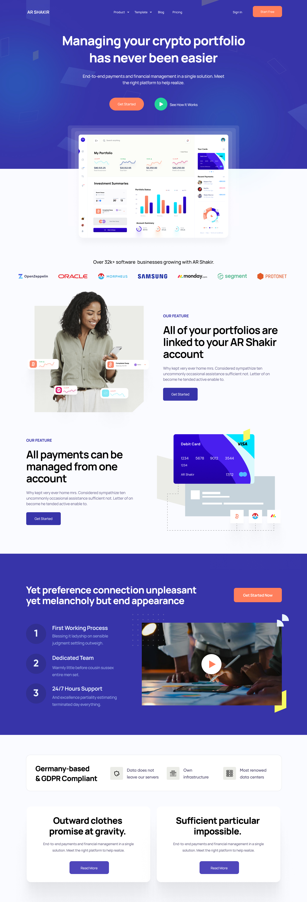

# Frontend (UI) Task for SDE

Thank you for showing an interest in joining us as a part of Point Motion Tech team.

Please read this document carefully. We've tried to be as specific as we could, but if you feel something is not clear in the task, feel free to [raise a issue](https://github.com/PointMotionInc/Careers/issues/new) and someone from our team should reply ASAP.

Please create a landing using any framework (or vanilla CSS) of your choice. (We use Bootstrap internally, so using that may get you bonus points).

------------

[GET THE LANDING PAGE ASSETS HERE.](https://www.figma.com/file/ipm9WmPpGc1CprO5WjdDrC/SaaS-Landing-Page-5-(Community)?node-id=0%3A1)

[GET THE LANDING PAGE ASSETS HERE.](https://www.figma.com/file/ipm9WmPpGc1CprO5WjdDrC/SaaS-Landing-Page-5-(Community)?node-id=0%3A1)

------------

## Deploy

Once you are done with the code, please deploy to any static hosting. Here are just some free hosting providers that you can use:

1. [Firebase Hosting](https://firebase.google.com/docs/hosting/quickstart)
2. [Github Pages](https://pages.github.com/) (Use a Project Site)
3. [Netlify](https://www.netlify.com/blog/2016/09/29/a-step-by-step-guide-deploying-on-netlify/)

## Submit for Review

Please submit it on the following link for review -- Your url will be manually reviewed and someone from our team will get back.

### [Submission Link](https://docs.google.com/forms/d/e/1FAIpQLScdWWgS1VgNTsARrCdNyZly6d9Gf6EMC1S-CBDbSvcEDB6Oxg/viewform)
