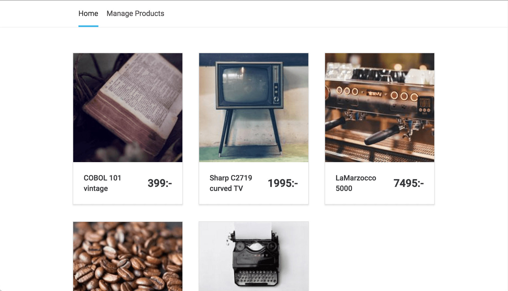
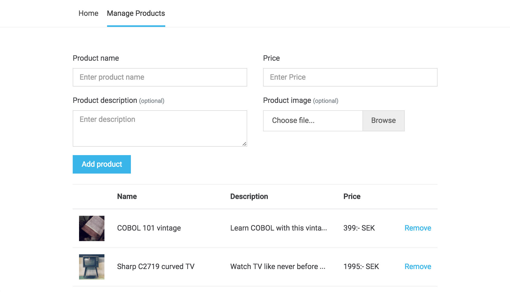

# Frontend Task for SDE

Thank you for showing an interest in joining us as a part of Point Motion Tech team.

Please read this document carefully. We've tried to be as specific as we could, but if you feel something is not clear in the task, feel free to [raise a issue](https://github.com/PointMotionInc/Careers/issues/new) and someone from our team should reply ASAP.

Please create a web app using any framework of your choice. (We use Angular internally, so using that will give you bonus points).

The web app that you will build for this task will be a simple 2 screen app. The app should allow the user to add products in a REDUX store and show them as a list on the other page.

If you don't know Redux, here is [a quick video to understand what redux is](https://www.youtube.com/watch?v=np8A_aW7Pew). If you're using Angular, we recommend you use [ngrx](https://ngrx.io/guide/store) as your library. 

----------

Coming to the pages. The Home page (see below) should render a list of products from the REDUX Store.

The second page should contain a form to add products. The product list should be stored in the global state (with redux architecture).

Hint: You can store images using Base64 in the store.

--------

Your work will be evaluated on the `code quality`, `cleanliness of the design` and how well you `handle edge-cases`. Feel free to use any CSS Framework/Library -- like Bootstrap, Tailwind or any other library you like.

----

## Deploy

Once you are done with the code, please deploy to any static hosting. Here are just some free hosting providers that you can use:

1. [Firebase Hosting](https://firebase.google.com/docs/hosting/quickstart)
2. [Github Pages](https://pages.github.com/) (Use a Project Site)
3. [Netlify](https://www.netlify.com/blog/2016/09/29/a-step-by-step-guide-deploying-on-netlify/)

## Submit for Review

Please submit it on the following link for review -- Your url will be manually reviewed and someone from our team will get back.

### [Submission Link](https://docs.google.com/forms/d/e/1FAIpQLScdWWgS1VgNTsARrCdNyZly6d9Gf6EMC1S-CBDbSvcEDB6Oxg/viewform)
